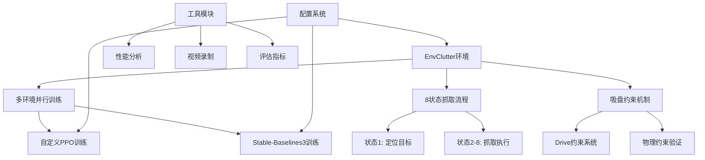

# V2-Suction: 智能机器人吸盘抓取强化学习环境

## 📋 项目概述

**V2-Suction** 是一个基于强化学习的高级机器人吸盘抓取环境，使用ManiSkill框架构建。该项目实现了复杂的多物体堆叠场景中的智能抓取任务，支持多环境并行训练，具备完整的8状态抓取流程和先进的吸盘约束机制。

### 🎯 核心特性

- **🤖 智能抓取策略**：基于强化学习的自适应物体选择和抓取
- **⚡ 多环境并行**：支持高效的多环境同步训练
- **🔧 双动作模式**：同时支持离散和连续动作空间
- **📊 丰富奖励系统**：多维度奖励设计优化抓取行为
- **🎮 灵活配置**：完整的配置管理系统
- **📹 可视化支持**：训练过程录制和分析工具

### 🏗️ 技术架构



---

## 📁 项目结构

```
v2-suction/
├── 🔧 核心环境
│   ├── env_clutter.py              # 主要环境实现 (1583行)
│   ├── config.py                   # 配置管理系统 (359行)
│   └── utils.py                    # 工具函数集合 (497行)
│
├── 🎯 训练系统
│   ├── train_sb3.py                # SB3训练脚本 (413行)
│   ├── training.py                 # 自定义PPO训练 (566行)
│   └── inference.py                # 模型推理脚本 (317行)
│
├── 🔗 环境包装器
│   └── wrappers/
│       ├── mask_wrapper.py         # 动作掩码包装器
│       └── __init__.py
│
├── 📊 测试与分析
│   ├── test_quick_fix.py           # 快速测试脚本
│   ├── debug_wrapper.py            # 调试包装器
│   └── example.py                  # 使用示例
│
├── 📋 文档与配置
│   ├── requirements_sb3.txt        # 依赖列表
│   ├── PROBLEM_ANALYSIS_SOLUTION.md
│   ├── INDEX_FIXES_SUMMARY.md
│   ├── PERFORMANCE_ANALYSIS.md
│   ├── suction.md                  # 吸盘机制文档
│   ├── parallel-training.md        # 并行训练文档
│   └── README_*.md                 # 各种说明文档
│
└── 💾 输出目录
    ├── models/                     # 训练模型
    ├── logs/                       # 训练日志
    └── test_videos/                # 测试视频
```

---

## 🚀 快速开始

### 1. 环境准备

```bash
# 克隆项目
cd /path/to/RL_RobotArm-main/v2-suction

# 安装依赖
pip install -r requirements_sb3.txt

# 安装ManiSkill环境（如果未安装）
pip install mani-skill
```

### 2. 快速测试

```bash
# 运行基础测试
python example.py

# 运行调试测试
python test_quick_fix.py
```

### 3. 开始训练

#### 方法一：使用Stable-Baselines3 (推荐)

```bash
# 快速训练（小规模）
python train_sb3.py --num_envs 32 --total_timesteps 100000

# 高质量训练（大规模）
python train_sb3.py --num_envs 128 --total_timesteps 1000000 \
    --record_video --log_dir ./logs/high_quality

# 评估模型
python train_sb3.py --mode eval --model_path ./models/best_model.zip
```

#### 方法二：使用自定义PPO

```bash
# 开始训练
python training.py --config fast_train --epochs 500

# 多环境并行训练
python training.py --config multi_env --num_envs 8
```

---

## 🏗️ 核心架构详解

### 1. 🌍 环境系统 (`env_clutter.py`)

#### 核心类：`EnvClutterEnv`

```python
@register_env("EnvClutter-v1", asset_download_ids=["ycb"], max_episode_steps=200)
class EnvClutterEnv(BaseEnv):
    """
    复杂堆叠抓取环境核心类
    
    主要特性：
    - 支持3-18个YCB物体的堆叠场景
    - Panda/Fetch机器人支持
    - 8状态智能抓取流程
    - 多环境并行优化
    """
```

#### 关键功能模块

1. **🎲 场景生成系统**
   ```python
   def _load_scene(self):
       """动态生成多物体堆叠场景"""
       # 托盘和物体随机放置
       # 支持1-16个环境并行
       # YCB数据集物体加载
   ```

2. **🎯 8状态抓取流程**
   ```python
   def _pick_object_8_states(self, obj_idx: int, env_idx: int = 0):
       """
       状态1: 选择目标物体
       状态2-3: 移动到物体上方
       状态4-5: 下降接触物体
       状态6: 激活吸盘约束
       状态7-8: 抓起并放置
       """
   ```

3. **🔧 吸盘约束机制**
   ```python
   def create_suction_constraint(self, target_object, env_idx):
       """创建物理吸盘约束"""
       constraint = Drive.create_from_actors_or_links(
           scene=self.scene,
           entities0=self.agent.tcp,     # 机械臂末端
           entities1=target_object,      # 目标物体
           pose0=sapien.Pose(),
           pose1=sapien.Pose(),
           scene_idxs=torch.tensor([env_idx], device=self.device)
       )
   ```

### 2. ⚙️ 配置系统 (`config.py`)

#### 分层配置架构

```python
@dataclass
class Config:
    env: EnvConfig           # 环境参数配置
    training: TrainingConfig # 训练超参数配置  
    model: ModelConfig       # 网络架构配置
    reward: RewardConfig     # 奖励函数配置
    evaluation: EvaluationConfig  # 评估指标配置
```

#### 预设配置方案

```python
PRESET_CONFIGS = {
    "default": {...},           # 标准训练配置
    "fast_train": {...},        # 快速训练配置
    "high_quality": {...},      # 高质量训练配置
    "sparse_reward": {...},     # 稀疏奖励配置
    "multi_env": {...},         # 多环境配置
    "large_scene": {...},       # 大场景配置(18物体)
    "small_scene": {...}        # 小场景配置(6物体)
}
```

### 3. 🎯 训练系统

#### Stable-Baselines3集成 (`train_sb3.py`)

```python
# 支持MaskablePPO和标准PPO
if MASKABLE_AVAILABLE:
    model = MaskablePPO("MlpPolicy", vec_env, **model_kwargs)
else:
    model = PPO("MlpPolicy", vec_env, **model_kwargs)

# 多环境向量化
vec_env = ManiSkillSB3VectorEnv(env)
```

#### 自定义PPO实现 (`training.py`)

```python
class PPOAgent:
    """完整的PPO智能体实现"""
    def __init__(self, state_dim, action_dim, lr_actor=3e-4, lr_critic=3e-4):
        self.actor = PPOActor(state_dim, action_dim)
        self.critic = PPOCritic(state_dim)
        # 支持离散动作的Categorical分布
```

### 4. 🔄 环境包装器系统 (`wrappers/`)

#### 动作掩码包装器
```python
class ExtractMaskWrapper(gym.ObservationWrapper):
    """将观测拆分为[action_mask, state_features]"""
    
class ActionConversionWrapper(gym.ActionWrapper):  
    """连续动作到离散动作转换"""
    
class SB3CompatWrapper(gym.Wrapper):
    """确保与Stable-Baselines3完全兼容"""
```

---

## 🎮 动作空间设计

### 离散动作模式 (推荐)

```python
# 动作空间：Discrete(15) 
# 动作含义：选择抓取哪个物体
action_space = gym.spaces.Discrete(15)

# 动作执行流程
def _discrete_step(self, action):
    """
    1. 根据action索引选择目标物体
    2. 执行8状态抓取流程
    3. 返回奖励和完成状态
    """
```

### 连续动作模式

```python
# 动作空间：Box(7) - [位置(3) + 旋转(4)]
action_space = gym.spaces.Box(low=-1.0, high=1.0, shape=(7,))

# 直接控制末端执行器姿态
def _continuous_step(self, action):
    """直接控制TCP位置和方向"""
```

---

## 📊 奖励系统详解

### 多维度奖励函数

```python
def compute_dense_reward(self):
    """密集奖励计算"""
    
    # 1. 接近奖励 - 鼓励接近目标物体
    reaching_reward = -distance_to_target * self.config.reward.reaching_weight
    
    # 2. 抓取奖励 - 成功抓取物体
    grasping_reward = grasp_success * self.config.reward.grasping_weight
    
    # 3. 放置奖励 - 成功放置到目标位置  
    placing_reward = place_success * self.config.reward.placing_weight
    
    # 4. 扰动惩罚 - 减少对其他物体的干扰
    displacement_penalty = -other_objects_moved * self.config.reward.displacement_weight
    
    # 5. 时间效率奖励 - 鼓励快速完成
    time_reward = -episode_length * self.config.reward.time_weight
    
    # 6. 静止奖励 - 鼓励稳定抓取
    static_reward = robot_stillness * self.config.reward.static_weight
    
    # 7. 成功奖励 - 任务完成大奖励
    success_reward = task_completed * self.config.reward.success_weight
    
    total_reward = (reaching_reward + grasping_reward + placing_reward + 
                   displacement_penalty + time_reward + static_reward + success_reward)
```

### 稀疏奖励模式

```python
def compute_sparse_reward(self):
    """稀疏奖励 - 只在成功时给予奖励"""
    if self.check_success():
        return self.config.reward.sparse_success_reward
    else:
        return self.config.reward.sparse_displacement_weight * displacement_penalty
```

---

## 🔧 高级功能

### 1. 多环境并行训练

```python
# 环境创建
env = gym.make(
    "EnvClutter-v1",
    num_envs=128,           # 128个并行环境
    parallel_in_single_scene=True,  # 单场景并行优化
    sim_backend="gpu",      # GPU加速仿真
)

# 批量处理机制
def _discrete_step(self, actions):
    """处理多环境的批量动作"""
    # actions: [env0_action, env1_action, ..., env127_action]
    # 并行执行所有环境的动作
```

### 2. 智能物体选择

```python
def _update_remaining_objects(self):
    """动态更新可抓取物体列表"""
    valid_objects = []
    for obj_idx, obj in enumerate(self.all_objects):
        if self._is_object_graspable(obj):
            valid_objects.append(obj_idx)
    self.remaining_indices = valid_objects
```

### 3. 物理约束验证

```python
def check_contact(self, target_object, env_idx):
    """检查TCP与物体的接触状态"""
    distance = self._compute_tcp_object_distance(target_object, env_idx)
    return distance < self.SUCTION_DISTANCE_THRESHOLD

def check_grasp_success(self, target_object, env_idx):
    """验证抓取是否成功"""
    return self.check_contact(target_object, env_idx) and \
           self._is_object_lifted(target_object)
```

### 4. 性能优化

```python
# GPU内存优化配置
def _configure_gpu_memory(self):
    """优化GPU内存使用"""
    sim_cfg = SimConfig()
    sim_cfg.gpu_memory_config = GPUMemoryConfig(
        max_rigid_contact_count=2**20,
        max_rigid_patch_count=2**18,
    )
    return sim_cfg
```

---

## 🧪 实验配置

### 基础实验配置

```python
# 小场景快速实验
config = {
    "env": {
        "num_objects_per_type": 2,      # 每类2个物体
        "total_objects_per_env": 6,     # 总共6个物体
        "max_episode_steps": 100,
    },
    "training": {
        "epochs": 300,
        "num_envs": 16,
    }
}
```

### 高质量训练配置

```python
# 大场景高质量训练
config = {
    "env": {
        "num_objects_per_type": 6,      # 每类6个物体
        "total_objects_per_env": 18,    # 总共18个物体
        "max_episode_steps": 300,
    },
    "training": {
        "epochs": 2000,
        "num_envs": 128,
        "lr_actor": 1e-4,
        "lr_critic": 1e-4,
    },
    "model": {
        "actor_hidden_dims": [512, 512, 256],
        "critic_hidden_dims": [512, 512, 256],
    }
}
```

---

## 📈 训练监控

### TensorBoard监控

```bash
# 启动训练时会自动记录到./logs/
tensorboard --logdir ./logs --port 6006
```

监控指标包括：
- **训练奖励**：episode_reward, mean_reward
- **成功率**：success_rate, grasp_success_rate  
- **效率指标**：episode_length, time_efficiency
- **物理指标**：displacement_penalty, constraint_violations

### CSV日志

```python
# 自动保存训练数据到CSV
logger = CsvLogger('./logs/training_log.csv')
logger.log({
    'epoch': epoch,
    'mean_reward': mean_reward,
    'success_rate': success_rate,
    'episode_length': mean_episode_length
})
```

---

## 🎬 可视化和录制

### 训练过程录制

```python
# 启用视频录制
env = RecordEpisode(
    env,
    output_dir="./videos",
    save_video=True,
    trajectory_name="training_demo",
    max_steps_per_video=200,
    video_fps=30,
)
```

### 推理演示

```python
# 加载训练好的模型进行推理演示
python inference.py --model_path ./models/best_model.pth \
    --render --record_video --num_episodes 5
```

---

## 🚀 性能优化建议

### 1. 硬件配置优化

```python
# GPU内存配置
sim_cfg.gpu_memory_config = GPUMemoryConfig(
    max_rigid_contact_count=2**20,    # 最大刚体接触数
    max_rigid_patch_count=2**18,      # 最大刚体补丁数
)

# 多核CPU优化
training_config.num_workers = 4      # 数据加载并行度
```

### 2. 训练策略优化

```python
# 梯度累积策略
training_config.batch_size = 2048     # 大批次训练
training_config.n_steps = 256         # 每环境步数

# 学习率调度
training_config.lr_schedule = "cosine_annealing"
```

### 3. 内存使用优化

```python
# 环境配置优化
env_config.num_envs = 64              # 根据GPU内存调整
env_config.max_episode_steps = 200    # 控制episode长度
```

---

## 🔍 故障排除

### 常见问题

1. **索引越界错误**
   ```python
   # 问题：多环境索引不匹配
   # 解决：使用安全索引访问
   if env_idx < tensor.shape[0]:
       value = tensor[env_idx]
   else:
       value = tensor[0]  # 安全回退
   ```

2. **相对导入错误**
   ```python
   # 问题：ImportError: attempted relative import
   # 解决：使用兼容导入
   try:
       from .config import Config
   except ImportError:
       from config import Config
   ```

3. **内存不足**
   ```bash
   # 解决：减少并行环境数量
   python train_sb3.py --num_envs 32  # 从128减少到32
   ```

4. **训练不收敛**
   ```python
   # 解决：调整奖励权重和学习率
   reward_config.success_weight = 20.0     # 增加成功奖励
   training_config.lr_actor = 1e-4        # 降低学习率
   ```

---

## 📚 扩展开发

### 自定义物体

```python
# 在config.py中添加新的YCB物体
env_config.box_objects = [
    "004_sugar_box",
    "006_mustard_bottle", 
    "008_pudding_box",
    "YOUR_CUSTOM_OBJECT",  # 添加新物体
]
```

### 自定义奖励函数

```python
# 继承并重写奖励计算
class CustomEnvClutter(EnvClutterEnv):
    def compute_dense_reward(self):
        base_reward = super().compute_dense_reward()
        custom_reward = self._compute_custom_reward()
        return base_reward + custom_reward
```

### 添加新的机器人

```python
# 扩展支持的机器人类型
SUPPORTED_ROBOTS = ["panda", "fetch", "your_robot"]

def _load_agent(self):
    if self.robot_uids == "your_robot":
        return YourCustomRobot(...)
```

---

## 📄 许可证

此项目遵循 MIT 许可证。详情请参见 LICENSE 文件。

---

## 🤝 贡献

欢迎提交问题报告、功能请求和Pull Request！

### 开发环境设置

```bash
# 1. Fork并克隆项目
git clone https://github.com/your-username/RL_RobotArm-main.git

# 2. 创建开发分支
git checkout -b feature/your-feature

# 3. 安装开发依赖
pip install -r requirements_sb3.txt
pip install -e .

# 4. 运行测试
python test_quick_fix.py
```

---

## 📞 支持

如遇到问题，请：
1. 查看[故障排除](#-故障排除)部分
2. 检查已有的Issue
3. 创建新的Issue并提供详细信息

---

*🎯 这个README文档详细介绍了V2-Suction项目的完整架构、使用方法和技术细节。希望能够帮助你快速理解和使用这个强化学习环境！*
